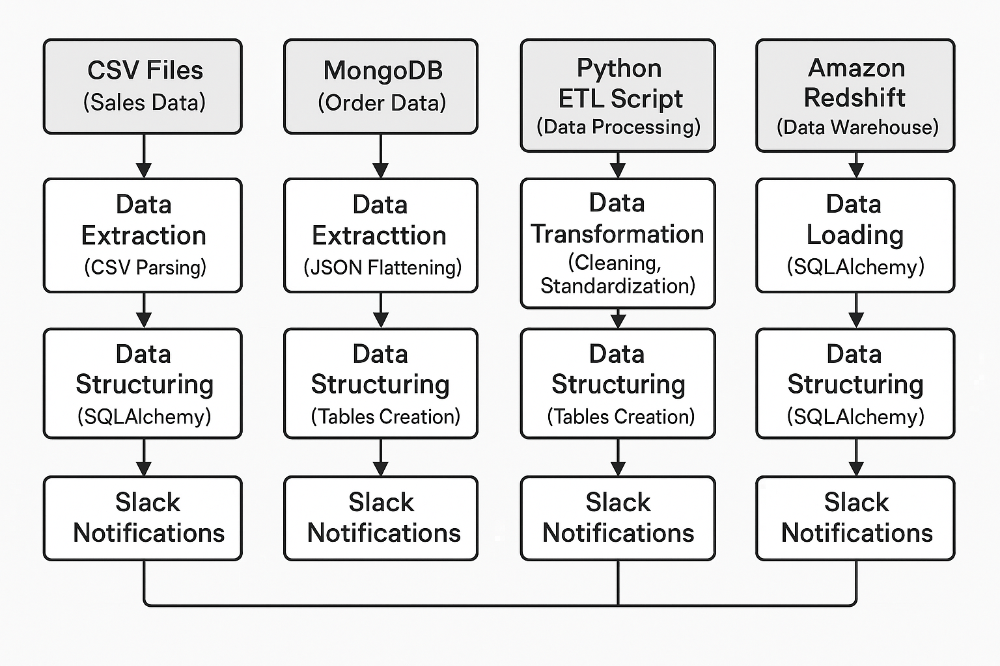

 # 🛠️ Data Engineering Sales Data Project on AWS

## 🌐 Overview

This project aims to **securely manage, streamline, and analyze** both structured and semi-structured data from multiple sources, leveraging cloud infrastructure for scalability and performance.

---

## 🎯 Project Goals

✅ **Data Ingestion** — Build mechanisms to ingest data from various sources (CSV, JSON, MongoDB).  
✅ **ETL System** — Transform raw data by flattening nested MongoDB data, cleaning, and standardizing it using Python and Jupyter notebooks with webhooks.  
✅ **Data Lake** — Centralize multi-source data into an S3-based data lake for easy access and storage.  
✅ **Scalability** — Design a system that can **scale seamlessly** as data volume grows.  
✅ **Cloud Integration** — Leverage **AWS** services for large-scale data processing, storage, and analytics.

---

## ⚙️ Technologies Used

- 🐍 **Python** — ETL processing & scripting  
- 🐼 **Pandas** — Data transformation & manipulation  
- 🍃 **PyMongo** — MongoDB data extraction  
- 🏛️ **SQLAlchemy** — Amazon Redshift integration  
- 🔔 **Slack API** — Real-time ETL process notifications  
- 📓 **Jupyter Notebook / Google Colab** — Exploratory data analysis  
- 🧭 **MongoDB Compass** — Data visualization & flattening

---

## 📦 Dataset

Daily retail store sales data (CSV format) combined with order data from MongoDB.

---

## 🏗️ Architecture Diagram

---

## 📚 Full Process Documentation

Click the link below to see the entire ETL process, architecture explanation, and detailed step-by-step documentation.

👉 **[View Full Documentation](#)** *(https://github.com/srikanthin97/Sales-data-project/blob/main/case%20study%20.docx)*

---

## 🚀 Key Highlights

- Fully cloud-based architecture using AWS for scalability.
- Real-time pipeline monitoring and Slack notifications.
- Modular and maintainable ETL scripts in Python.
- Clean and well-organized data pipelines for analytics-ready datasets.
- Designed with future growth and flexibility in mind.

---

💬 **Feel free to fork this project, open issues, or contribute!**

